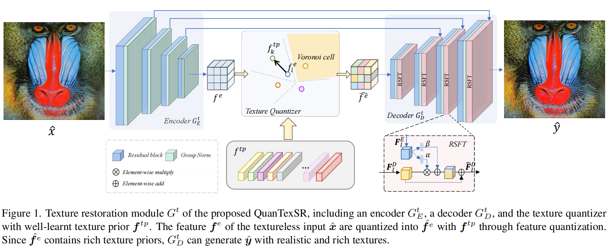

# QuanTexSR

This is the official PyTorch codes for the paper  
[Blind Image Super Resolution with Semantic-Aware Quantized Texture Prior](https://arxiv.org/abs/2202.13142)  
[Chaofeng Chen\*](https://chaofengc.github.io), [Xinyu Shi\*](https://github.com/Xinyu-Shi), [Yipeng Qin](http://yipengqin.github.io/), [Xiaoming Li](https://csxmli2016.github.io/), [Xiaoguang Han](https://mypage.cuhk.edu.cn/academics/hanxiaoguang/), [Tao Yang](https://github.com/yangxy), [Shihui Guo](http://guoshihui.net/)   
(\* indicates equal contribution)



### Update

- **2022.03.02**: Add onedrive download link for pretrained weights.

Here are some example results on test images from [BSRGAN](https://github.com/cszn/BSRGAN) and [RealESRGAN](https://github.com/xinntao/Real-ESRGAN).

---

**Left**: [real images](./testset) **|** **Right**: [super-resolved images with scale factor 4](./results)

 
 
 
 
 

<!--  
 
 
 
  -->


## Dependencies and Installation

- Ubuntu >= 18.04
- CUDA >= 11.0
- Other required packages in `requirements.txt`
```
# git clone this repository
git clone https://github.com/chaofengc/QuanTexSR.git
cd QuanTexSR

# create new anaconda env
conda create -n quantexsr python=3.8
source activate quantexsr

# install python dependencies
pip3 install -r requirements.txt
python setup.py develop
```

## Quick Inference

Download pretrained model (**only provide x4 model now**) from
- [BaiduNetdisk](https://pan.baidu.com/s/1H_9TIJUHEgAe75VToknbIA ), extract code `qtsr` . 
- [OneDrive](https://entuedu-my.sharepoint.com/:f:/g/personal/chaofeng_chen_staff_main_ntu_edu_sg/EuqbHtP9-f9OjzLpyIftKH0Bp8WVlT-8FNX6-boTeqE47w)

Test the model with the following script
```
python inference_quantexsr.py -w ./path/to/model/weight -i ./path/to/test/image[or folder]
```

## Train the model

### Preparation

#### Dataset

Please prepare the training and testing data follow descriptions in the main paper and supplementary material. In brief, you need to crop 512 x 512 high resolution patches, and generate the low resolution patches with [`degradation_bsrgan`](https://github.com/cszn/BSRGAN/blob/3a958f40a9a24e8b81c3cb1960f05b0e91f1b421/utils/utils_blindsr.py?_pjax=%23js-repo-pjax-container%2C%20div%5Bitemtype%3D%22http%3A%2F%2Fschema.org%2FSoftwareSourceCode%22%5D%20main%2C%20%5Bdata-pjax-container%5D#L432) function provided by [BSRGAN](https://github.com/cszn/BSRGAN). While the synthetic testing LR images are generated by the [`degradation_bsrgan_plus`](https://github.com/cszn/BSRGAN/blob/3a958f40a9a24e8b81c3cb1960f05b0e91f1b421/utils/utils_blindsr.py?_pjax=%23js-repo-pjax-container%2C%20div%5Bitemtype%3D%22http%3A%2F%2Fschema.org%2FSoftwareSourceCode%22%5D%20main%2C%20%5Bdata-pjax-container%5D#L524) function for fair comparison.

#### Model preparation

Before training, you need to put the following pretrained models in `experiments/pretrained_models` and specify their path in the corresponding option file.

- HQ pretrain stage: pretrained semantic cluster codebook
- LQ stage (SR model training): pretrained semantic aware vqgan, pretrained PSNR oriented RRDB model
- lpips weight for validation

The above models can be downloaded from the BaiduNetDisk.

### Train SR model

```
python basicsr/train.py -opt options/train_QuanTexSR_LQ_stage.yml
```

### Model pretrain

In case you want to pretrain your own VQGAN prior, we also provide the training instructions below.

#### Pretrain semantic codebook

The semantic-aware codebook is obtained with VGG19 features using a mini-batch version of K-means, optimized with Adam. This script will give three levels of codebooks from `relu3_4`, `relu4_4` and `relu5_4` features. We use `relu4_4` for this project.

```
python basicsr/train.py -opt options/train_QuanTexSR_semantic_cluster_stage.yml
```

#### Pretrain of semantic-aware VQGAN

```
python basicsr/train.py -opt options/train_QuanTexSR_HQ_pretrain_stage.yml
```

## Citation
```
@misc{chen2022quantexsr,
      author={Chaofeng Chen and Xinyu Shi and Yipeng Qin and Xiaoming Li and Xiaoguang Han and Tao Yang and Shihui Guo},
      title={Blind Image Super Resolution with Semantic-Aware Quantized Texture Prior}, 
      year={2022},
      eprint={2202.13142},
      archivePrefix={arXiv},
      primaryClass={cs.CV}
}
```

## License

<a rel="license" href="http://creativecommons.org/licenses/by-nc-sa/4.0/"></a><br />This work is licensed under a <a rel="license" href="http://creativecommons.org/licenses/by-nc-sa/4.0/">Creative Commons Attribution-NonCommercial-ShareAlike 4.0 International License</a>.

## Acknowledgement

This project is based on [BasicSR](https://github.com/xinntao/BasicSR).
